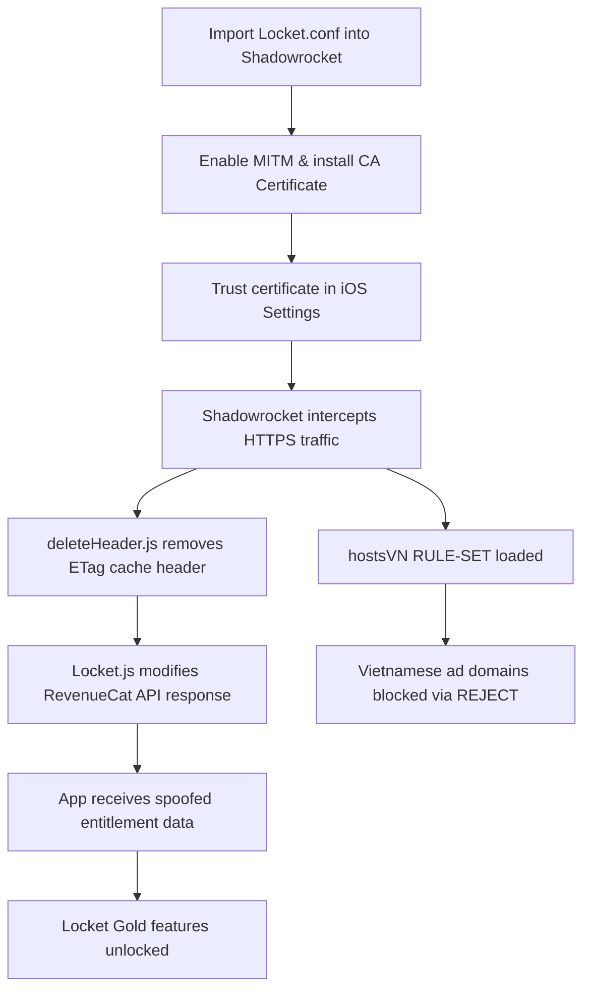
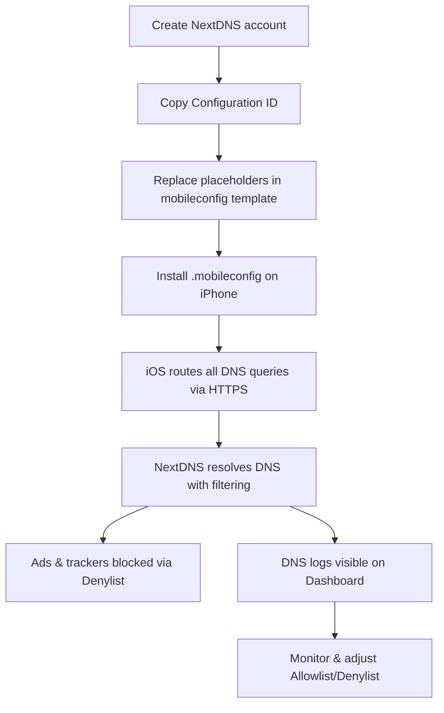

<p align="center">
  
</p>

<h1 align="center">Locket Gold</h1>

<p align="center">
  <a href="https://github.com/Long18/shadowrocket/stargazers"></a>
  <a href="https://github.com/Long18/shadowrocket/network"></a>
  <a href="https://github.com/Long18/shadowrocket/blob/main/LICENSE"></a>
  
  
  
</p>

---

> [!IMPORTANT]
> This repository is for educational, personal DNS configuration, and privacy filtering purposes only.
> Do not use this project to bypass payment, app entitlement, or subscription verification.

---

## 📖 Table of Contents

- [Quick Start — Shadowrocket](#-quick-start--shadowrocket)
- [Quick Start — NextDNS](#-quick-start--nextdns)
- [How It Works](#-how-it-works)
- [Project Structure](#-project-structure)
- [Documentation](#-documentation)
- [Credit](#-credit)

---

## ⚡ Quick Start — Shadowrocket

### Step 1: Import Config

Copy this URL and import into Shadowrocket:

```
https://raw.githubusercontent.com/Long18/shadowrocket/main/Locket.conf
```

Or use the standalone module:

```
https://raw.githubusercontent.com/Long18/shadowrocket/main/modules/Locket.sgmodule
```

### Step 2: Enable MITM

1. Open Shadowrocket → tap the config file ⓘ
2. Go to **HTTPS Decryption**
3. Tap **Generate New CA Certificate**
4. Tap **Install Certificate**
5. On iPhone: **Settings → General → About → Certificate Trust Settings**
6. Enable trust for the Shadowrocket certificate

### Step 3: Verify

1. Make sure the config is selected and Shadowrocket is connected
2. Open the Locket app
3. Check that Gold features are active

> If not working: force-close Locket → reconnect Shadowrocket → reopen Locket.

---

## 🌐 Quick Start — NextDNS

### Step 1: Create NextDNS Account

1. Go to [https://nextdns.io](https://nextdns.io)
2. Sign up for a free account
3. Open Dashboard and copy your **Configuration ID** (e.g., `abc123`)

### Step 2: Customize the Template

Open `PersonalNextDNS.mobileconfig` and replace placeholders:

| Placeholder | Replace with | Example |
|---|---|---|
| `{{NEXTDNS_ID}}` | Your Configuration ID | `abc123` |
| `{{DEVICE_NAME}}` | Device name (shown on NextDNS dashboard) | `iPhone-16-Pro` |
| `{{PROFILE_DISPLAY_NAME}}` | Profile name on iPhone | `My Personal DNS` |
| `{{PROFILE_OWNER}}` | Your name (lowercase) | `william` |
| `{{DNS_PAYLOAD_UUID}}` | Run `uuidgen` in terminal | `A1B2C3D4-...` |
| `{{MAIN_PAYLOAD_UUID}}` | Run `uuidgen` again | `E5F6G7H8-...` |

### Step 3: Install on iPhone

1. AirDrop or email the `.mobileconfig` file to your iPhone
2. Open the file → tap **Allow**
3. Go to **Settings → General → VPN & Device Management**
4. Select the profile → tap **Install**

### Step 4: Verify

1. Open [NextDNS Dashboard](https://my.nextdns.io) → **Logs**
2. Browse Safari on iPhone
3. Confirm DNS queries appear with your device name

> If no logs: check that no other VPN/DNS app is active, and restart iPhone.

---

## 🔄 How It Works

### Shadowrocket Flow



### NextDNS Flow



---

## 📁 Project Structure

```
├── Locket.conf                    # Shadowrocket config (Locket + hostsVN)
├── PersonalNextDNS.mobileconfig   # NextDNS DNS-over-HTTPS template
├── docs/
│   ├── nextdns-setup.md           # Detailed tutorial (Vietnamese)
│   └── nextdns-setup_en.md        # Detailed tutorial (English)
├── js/
│   ├── Locket.js                  # RevenueCat response modifier
│   └── deleteHeader.js            # ETag header removal
└── modules/
    └── Locket.sgmodule            # Standalone Shadowrocket module
```

---

## 📚 Documentation

| Language | Link |
|----------|------|
| 🇻🇳 Tiếng Việt | [Hướng dẫn cài NextDNS cá nhân](docs/nextdns-setup.md) |
| 🇬🇧 English | [Personal NextDNS Setup Guide](docs/nextdns-setup_en.md) |

---

## 🙏 Credit

| | |
|---|---|
| **Repository** | [`Long18/shadowrocket`](https://github.com/Long18/shadowrocket) |
| **Maintainer** | William / Long18 |
| **hostsVN** | [`bigdargon/hostsVN`](https://github.com/bigdargon/hostsVN) — MIT License |
| **License** | [MIT](LICENSE) |

If you share, fork, or repost this project, please keep the source credit.

&nbsp;

<p align="center">
	
</p>

<p align="center">
	Copyright &copy; 2026-present <a href="https://github.com/long18" target="_blank">William</a>
</p>

<p align="center">
	<a href="https://github.com/Long18/shadowrocket/blob/main/LICENSE"></a>
</p>
